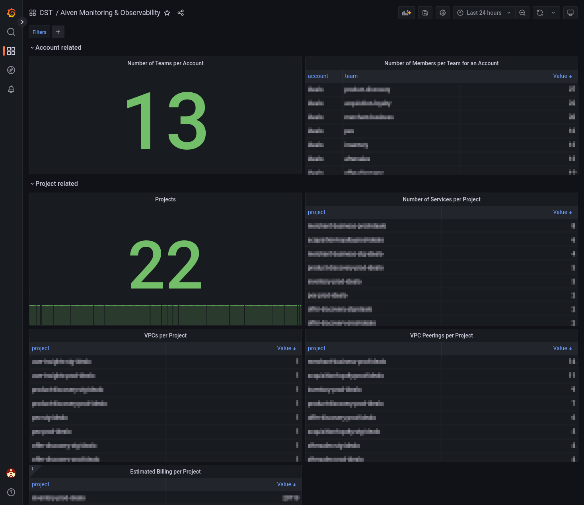
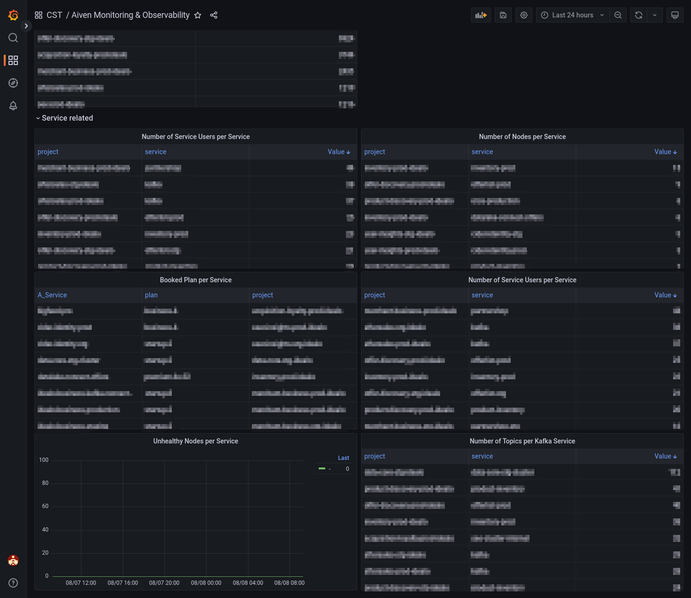

# Aiven Metadata Prometheus Exporter

## Why? 

As product-owning individuals, and Aiven is a product for us, we want to have monitoring and observability for that product in place. 

Here comes metadata information into the game. The prometheus exporter fetches metadata from the [Aiven](https://aiven.io/) API, especially account, project and service
  information.

## Available Metrics 📈

| Metric Name                           | Description |
|---------------------------------------|---|
| aiven_account_team_count_total        | The number of teams per account|
| aiven_account_team_member_count_total | The number of members per team for an account|
| aiven_project_count_total             | The number of projects registered in the account|
| aiven_service_count_total             | The number of services per project|
| aiven_project_estimated_billing_total | The estimated billing per project|
| aiven_project_vpc_count_total         | The number of VPCs per project|
| aiven_project_vpc_peering_count_total | The number of VPC peering connections per project|
| aiven_service_node_count_total        | Node count per service|
| aiven_service_node_state_info         | Node state per service|
| aiven_service_serviceuser_count_total | Service user count per service|
| aiven_service_topic_count_total       | Topic count per service|
| aiven_service_booked_plan_info        | The booked plan for a service|

## Installation 🖥️

A) Download the binaries from the [release page](https://github.com/idealo/aiven-metadata-prometheus-exporter/releases), untar and execute the binary

[//]: # (TODO -> Put an example here)

B) build a [docker image](Dockerfile) and run the docker image locally
  
    docker build -t aiven-metadata-prometheus-exporter:latest .
    docker run --rm -p 2112:2112 -e AIVEN_API_TOKEN=myAwesomeToken aiven-metadata-prometheus-exporter:latest

## Usage

This prometheus exporter leverages the [Aiven Go SDK](https://github.com/aiven/aiven-go-client)

The following arguments are available:

    Usage of bin/aiven-metadata-prometheus-exporter:
      -debug
            Enable debug logging
      -listen-address string
            Address to listen on for telemetry (default ":2112")
      -collect-interval string
            In which interval shall the metrics collected from the Aiven API (default "5m")
      -telemetry-path string
            Path under which to expose metrics (default "/metrics")

## Visualizing the Metrics with Grafana

* Those prometheus metrics are perfectly suited to create a Grafana dashboard out of it

    
    

* An example dashboard you can import is located at [resources/dashboard.json](resources/dashboard.json)
  * you have to replace targets.datasource.uid with your prometheus data source uid (or do it by hand when you've imported the dashboard) 

## Contributing 

*Contributions are highly welcome!*
* Feel free to contribute enhancements or bug fixes.
* For more details on how to contribute, please look at [CONTRIBUTING.md](CONTRIBUTING.md)

### Building and Testing

* If you want to contribute to the project, please make sure that
  * changes compile
  * tests are green
  
          $ go build -o bin/aiven-metadata-prometheus-exporter
          $ go test -v ./...
    
  * the changes are reflected on the `/metrics` endpoint 

          $ export AIVEN_API_TOKEN=MyToken; bin/aiven-metadata-prometheus-exporter
          $ curl -s localhost:2112/metrics

## License

This project is licensed under the MIT License - see the LICENSE file for details
